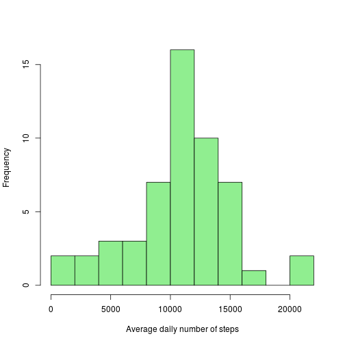
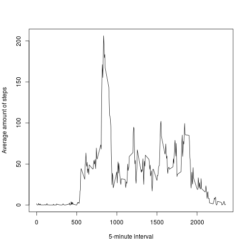
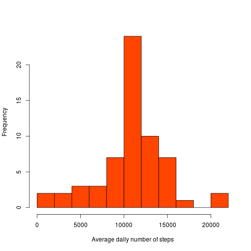
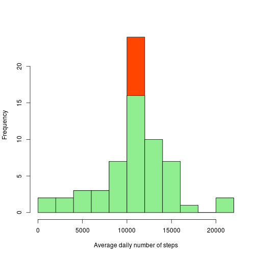
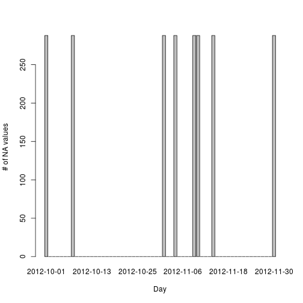
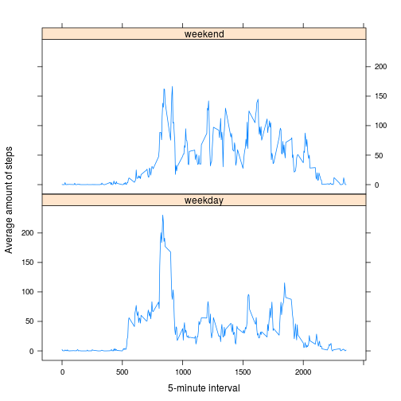

# Reproducible Research: Peer Assessment 1


## First things first

```r
# load libraries
library(knitr)
library(markdown)
library(lattice)

# set the local date format (among other things) to English
invisible(Sys.setlocale("LC_TIME", "C"))

# set paths
setwd(clone_dir)                # clone dir is assumed as existing environment variable
zipName = "./activity.zip"      # the .zip file is part of the cloned git repository
```

***

## Loading and preprocessing the data

### Load the data (i.e. read.csv())

```r
# load data
content <- unzip(zipName)
localFile <- content[1]
data <- read.csv(localFile)
```

### Preprocess the data

```r
# preprocess data, turning the date column into date objects
data$date <- as.Date(data$date, format="%Y-%m-%d")
# and creating a boolean mask of the complete cases
data.na.mask <- complete.cases(data)
```
Two preprocessing tasks have been carried out:

1. converting the strings in the date columns to proper Date objects and
2. creating a boolean mask of the complete cases, to be used in the next two steps

***

## What is mean total number of steps taken per day?

### Calculate the total number of steps taken per day

```r
steps_per_day <- aggregate(steps ~ date, data = data[data.na.mask,], FUN=sum)
```

Note how the rows containing NA have been omitted from the analysis.

### Make a histogram of the total number of steps taken each day

```r
# plot
hist(steps_per_day$steps,main="",xlab="Average daily number of steps",breaks=10,col="lightgreen")
```

 

### Calculate and report the mean and median of the total number of steps taken per day

```r
mean(steps_per_day$steps)
```

```
## [1] 10766.19
```

```r
median(steps_per_day$steps)
```

```
## [1] 10765
```

So the mean is 10766.19 steps per day, with the median value being 10765.

***

## What is the average daily activity pattern?

```r
avg_steps_interval <- aggregate(steps ~ interval, data = data[data.na.mask,], FUN = mean)
```

Note how, once again, the rows containing NA have been omitted from the analysis.

### Make a time series plot (i.e. type = "l") of the 5-minute interval (x-axis) and the average number of steps taken, averaged across all days (y-axis)

```r
plot(avg_steps_interval$steps ~ avg_steps_interval$interval,type = "l",main="",xlab="5-minute interval",ylab="Average amount of steps")
```

 

### Which 5-minute interval, on average across all the days in the dataset, contains the maximum number of steps?


```r
avg_steps_interval[which(avg_steps_interval$steps == max(avg_steps_interval$steps)),]
```

```
##     interval    steps
## 104      835 206.1698
```

The interval between 8:35 and 8:40 in the morning has the highest average count of steps: 206.17

***

## Imputing missing values

### Calculate and report the total number of missing values in the dataset 

```r
# how many NA values?
sum(is.na(data))
```

```
## [1] 2304
```

```r
# which is also
nrow(data) - nrow(data[data.na.mask,])
```

```
## [1] 2304
```

The dateset contains 2304 missing values.

### Devise a strategy for filling in all of the missing values in the dataset. 
The strategy that is going to be adopted is to fill every empty 5-minutes interval with the average value for that interval, which we just computed. 

### Create a new dataset that is equal to the original dataset but with the missing data filled in.

```r
# create a copy of the dataset
data_nna <- data
# recycle the averages on the interval K times, with K being the total number of days
avg_steps_padded <- rep(avg_steps_interval$steps,length(unique(as.POSIXct(data$date))))
# fill in the NA values with the corresponding interval averages
data_nna$steps[is.na(data_nna$steps)] <- avg_steps_padded[is.na(data_nna$steps)]
```

### Make a histogram of the total number of steps taken each day and Calculate and report the mean and median total number of steps taken per day. Do these values differ from the estimates from the first part of the assignment? What is the impact of imputing missing data on the estimates of the total daily number of steps?


```r
# this time around we can use tapply
steps_per_day_nna <- tapply(data_nna$steps,data_nna$date,sum)
hist(steps_per_day_nna,main="",xlab="Average daily number of steps",breaks=10,col="orangered")
```

 

The values do seem to differ: in particular, the central column looks taller.


```r
hist(steps_per_day_nna,main="",xlab="Average daily number of steps",breaks=10,col="orangered")
hist(steps_per_day$steps,main="",xlab="Average daily number of steps",breaks=10,col="lightgreen",add=T)
```

 

Overlapping the two histograms gives a clearer picture of it.


```r
mean(steps_per_day_nna)
```

```
## [1] 10766.19
```

```r
median(steps_per_day_nna)
```

```
## [1] 10766.19
```

It can be observed how the value of the mean stayed the same, while the median value became equal to the mean.

Let's try to explain why this happened. The reason the mean stayed the same is due to the peculiar distribution of the NA values in the original dataset: there are no random rows missing, but rather 8 entirely missing days. 

```r
na_per_day <- by(data$steps, data$date, function(x) sum(is.na(x)))
barplot(na_per_day,xlab="Day",ylab="# of NA values")
```

 


```r
sum(na_per_day)
```

```
## [1] 2304
```
We can see how summing the NA values contained in these days we get the total of NAs counted earlier. 
This to confirm that only the steps field contains NA values.

So the reason the mean stayed the same is that:

* we replaced the NA values with 8 times the amount of steps associated to each of the intervals, which is another way of saying "8 times the daily average of steps" and
* we added 8 days to the ones considered in the computation of the mean

It is pretty straightforward to see how these two facts counterbalance each other, and the mean ends ups being the same. 

The reason the median value of the average amount of steps per day changed to the mean is that we introduced 8 new days with an average amount of steps equal to the mean; the center of the distribution would then intuitively be relocated among these new days!


***

## Are there differences in activity patterns between weekdays and weekends?

### Create a new factor variable in the dataset with two levels – “weekday” and “weekend” indicating whether a given date is a weekday or weekend day.

```r
# create factor
levels <- list(weekday = c("Monday", "Tuesday", "Wednesday", "Thursday", "Friday"), weekend = c("Saturday", "Sunday"))
weekdayend <- factor(weekdays(data_nna$date))
levels(weekdayend) <- levels
# add column to the data frame
data_nna_wde <- cbind(data_nna[c(1,2)],weekdayend,data_nna[3])
```

### Make a panel plot containing a time series plot (i.e. type = "l") of the 5-minute interval (x-axis) and the average number of steps taken, averaged across all weekday days or weekend days (y-axis).

```r
avg_steps_i_wde <- aggregate(data_nna_wde$steps, by = list(data_nna_wde$interval,data_nna_wde$weekdayend), FUN = mean)
names(avg_steps_i_wde) <- c("interval","weekdayend","steps")

xyplot(steps ~ interval | weekdayend, avg_steps_i_wde, type = "l", layout = c(1, 2),xlab="5-minute interval",ylab="Average amount of steps")
```

 

We can note how indeed the patterns are different.  
In the weekend the activity seems to be more evenly spread around the day, while during the weekdays there is a peak of activity in the morning and a smaller peak towards the evening. 
A possible intuitive explanation for the peaks could be the commuting to and back from work.
